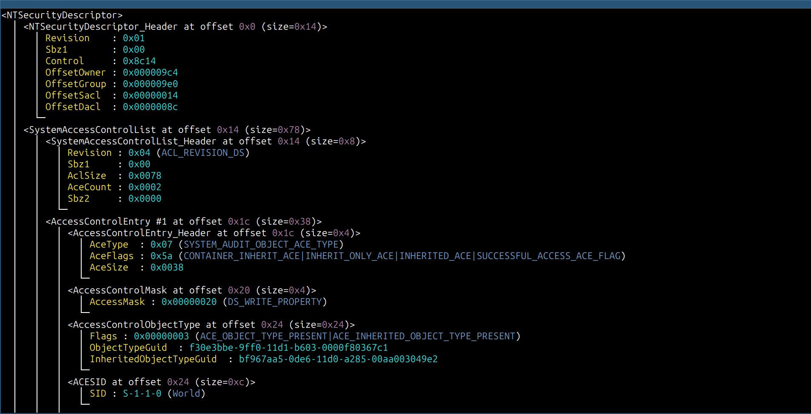

<p align="center">
  A python tool to parse and describe the contents of a raw ntSecurityDescriptor structure.
  <br>
  
  <a href="https://twitter.com/intent/follow?screen_name=podalirius_" title="Follow"></a>
  <a href="https://www.youtube.com/c/Podalirius_?sub_confirmation=1" title="Subscribe"></a>
  <br>
</p>

## Features

- [x] Parse Access Control Entries (ACE) of various types:
  - [x] ACE type [`ACCESS_ALLOWED_ACE`](https://learn.microsoft.com/en-us/openspecs/windows_protocols/ms-dtyp/72e7c7ea-bc02-4c74-a619-818a16bf6adb?wt.mc_id=SEC-MVP-5005286)
  - [x] ACE type [`ACCESS_ALLOWED_OBJECT_ACE`](https://learn.microsoft.com/en-us/openspecs/windows_protocols/ms-dtyp/c79a383c-2b3f-4655-abe7-dcbb7ce0cfbe?wt.mc_id=SEC-MVP-5005286)
  - [x] ACE type [`ACCESS_DENIED_ACE`](https://learn.microsoft.com/en-us/openspecs/windows_protocols/ms-dtyp/b1e1321d-5816-4513-be67-b65d8ae52fe8?wt.mc_id=SEC-MVP-5005286)
  - [x] ACE type [`ACCESS_DENIED_OBJECT_ACE`](https://learn.microsoft.com/en-us/openspecs/windows_protocols/ms-dtyp/8720fcf3-865c-4557-97b1-0b3489a6c270?wt.mc_id=SEC-MVP-5005286)
  - [x] ACE type [`ACCESS_ALLOWED_CALLBACK_ACE`](https://learn.microsoft.com/en-us/openspecs/windows_protocols/ms-dtyp/c9579cf4-0f4a-44f1-9444-422dfb10557a?wt.mc_id=SEC-MVP-5005286)
  - [x] ACE type [`ACCESS_DENIED_CALLBACK_ACE`](https://learn.microsoft.com/en-us/openspecs/windows_protocols/ms-dtyp/35adad6b-fda5-4cc1-b1b5-9beda5b07d2e?wt.mc_id=SEC-MVP-5005286)
  - [x] ACE type [`ACCESS_ALLOWED_CALLBACK_OBJECT_ACE`](https://learn.microsoft.com/en-us/openspecs/windows_protocols/ms-dtyp/fe1838ea-ea34-4a5e-b40e-eb870f8322ae?wt.mc_id=SEC-MVP-5005286)
  - [x] ACE type [`ACCESS_DENIED_CALLBACK_OBJECT_ACE`](https://learn.microsoft.com/en-us/openspecs/windows_protocols/ms-dtyp/4652f211-82d5-4b90-bd58-43bf3b0fc48d?wt.mc_id=SEC-MVP-5005286)
  - [x] ACE type [`SYSTEM_AUDIT_ACE`](https://learn.microsoft.com/en-us/openspecs/windows_protocols/ms-dtyp/9431fd0f-5b9a-47f0-b3f0-3015e2d0d4f9?wt.mc_id=SEC-MVP-5005286)
  - [x] ACE type [`SYSTEM_AUDIT_OBJECT_ACE`](https://learn.microsoft.com/en-us/openspecs/windows_protocols/ms-dtyp/c8da72ae-6b54-4a05-85f4-e2594936d3d5?wt.mc_id=SEC-MVP-5005286)
  - [x] ACE type [`SYSTEM_AUDIT_CALLBACK_ACE`](https://learn.microsoft.com/en-us/openspecs/windows_protocols/ms-dtyp/bd6b6fd8-4bef-427e-9a43-b9b46457e934?wt.mc_id=SEC-MVP-5005286)
  - [x] ACE type [`SYSTEM_MANDATORY_LABEL_ACE`](https://learn.microsoft.com/en-us/openspecs/windows_protocols/ms-dtyp/25fa6565-6cb0-46ab-a30a-016b32c4939a?wt.mc_id=SEC-MVP-5005286)
  - [x] ACE type [`SYSTEM_AUDIT_CALLBACK_OBJECT_ACE`](https://learn.microsoft.com/en-us/openspecs/windows_protocols/ms-dtyp/949b02e7-f55d-4c26-969f-52a009597469?wt.mc_id=SEC-MVP-5005286)
  - [x] ACE type [`SYSTEM_RESOURCE_ATTRIBUTE_ACE`](https://learn.microsoft.com/en-us/openspecs/windows_protocols/ms-dtyp/352944c7-4fb6-4988-8036-0a25dcedc730?wt.mc_id=SEC-MVP-5005286)
  - [x] ACE type [`SYSTEM_SCOPED_POLICY_ID_ACE`](https://learn.microsoft.com/en-us/openspecs/windows_protocols/ms-dtyp/aa0c0f62-4b4c-44f0-9718-c266a6accd9f?wt.mc_id=SEC-MVP-5005286)
- [x] Parse SID
  - [x] Connect to LDAP to resolve sAMAccountNames of not well known SIDs
  - [x] Resolve names of well known SIDs

## Demonstration

Here is an example of the output of the tool when parsing the ntSecurityDescriptor contained in the file [example_value.txt](./example_value.txt). This file contains a raw `ntSecurityDescriptor` structure in hex dump format:

```
0100148cc4090000e0090000140000008c0000000400780002000000075a38002000000003000000be3b0ef3f09fd111b6030000f80367c1a57a96bfe60dd011a28500aa003049e2010100000000000100000000075a380020000000030000
...
02000000000005200000002a02000000121800bd010f0001020000000000052000000020020000010500000000000515000000a3cd06bf0e0fe808c335b8e600020000010500000000000515000000a3cd06bf0e0fe808c335b8e600020000
```

Using [DescribeNTSecurityDescriptor.py](./DescribeNTSecurityDescriptor.py), we can open the file and parse its content precisely: 

```
./DescribeNTSecurityDescriptor.py ./example_value.txt
```



## Usage

```
$ ./DescribeNTSecurityDescriptor.py 
usage: DescribeNTSecurityDescriptor.py [-h] [-v] value

Parse and describe the contents of a raw ntSecurityDescriptor structure

positional arguments:
  value          The value to be described by the NTSecurityDescriptor

options:
  -h, --help     show this help message and exit
  -v, --verbose  Verbose mode. (default: False)
```

## Contributing

Pull requests are welcome. Feel free to open an issue if you want to add other features.
